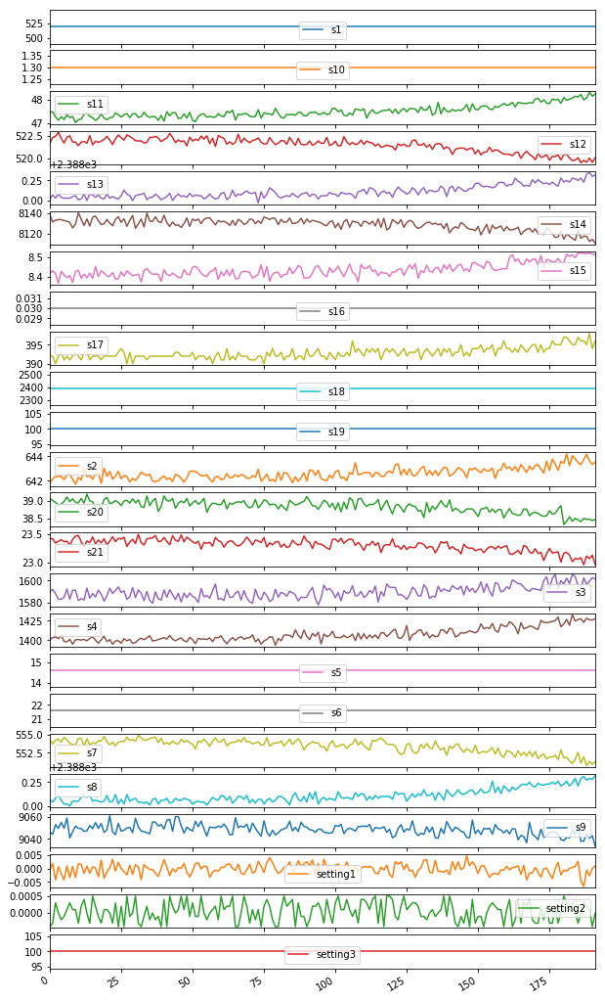
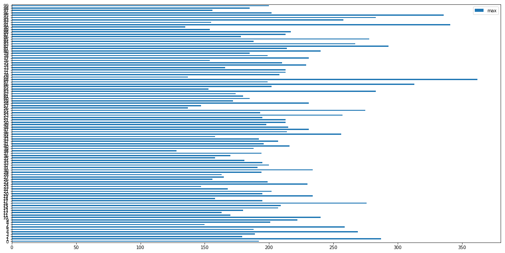
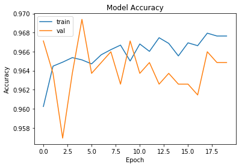
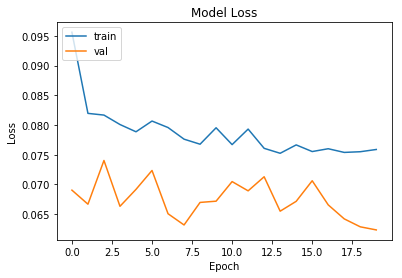

 <font color="blue"> \# Residual Useful Life Estimation | # Deep Learning | # Digital Transformation | # IIoT | # Industry 4.0 </font>


---


> ## # An  interactive demo is explored at https://arun-thomas.in/rul/


---


# Introduction

<div align="justify">
  
Rapid adoption of renewable energy sources, changes in regulatory environment with the implementation of SCED/MBED, stringent enviromental norms are putting immense pressure on operation of thermal power plants. The above externalities are forcing increased cyclic operation of thermal fleets, wherein frequent start up and shutdowns are causing varying load on assets like boilers, feed pumps, motors, pipes. Under such conditions, ensuring availiablity and safety of equipments is of prime significance. Consequently, utilities needs to strategize for a transition from a reactive maintenance approach to real time condition based health management eventually leading to preventive maintenance (PdM).

This webpage illustrates estimation of residual useful life (RUL) of an equipment using deep learning. The equipment is operating normally at the start of each time series, and develops a fault at some point during the series. In the training set, the fault grows in magnitude until system failure. In the test set, the time series ends some time prior to system failure. The objective is to predict, "What is the probability that the equipment will fail in the next n cycles/days?".

A datascience based process is utilized for predictive maintenance. The steps include preparing the dataset, visually exploring it, partioning the dataset for training and validation, validating the models using unseen dataset.


</div>


# Towards Multi Sensor approach

<div align="justify">
  
  Generally, conditioning monitoring of a machine is done by looking at a sensor measurement (Eg. Temperature, Vibration ) and imposing bounds to it, i.e. under normal operating conditions, the measurement values are bounded by a maximum and minimum value (similar to control charts). Any deviation in the defined bounds sends an alarm. This is often generally defined as anamoly detection.

However, this method often sends false alarms (false positives) or misses an alarm (false negative). Furthermore, a single signal is observed/analysed in isolation. For example, an alarm may sound if the temperature exceeeds a certain level. A system defined above often cannot look at mutiple parameters and come to a conclusion about the state of a machine. Or technical parlance, one cannot take advantage of the multi-dimensionality of the data.

Anamoly detection using a one variable (vibration in a bearing dataset) is explored in detailed in my <a href="#">blog article</a>. By analysing past trends of healthy (black points in graph), the model learns the expected trend with acceptable variance .A trained model predicts the trends for the future (The blue line represents the expected values from 2004-02-15, 23:42:39 with the light blue portion showing the acceptable variance) and if any deviation is observed, an alarm can be raised.
  
  </div>
  
  

# Softwares / Packages Used

<div align="justify">

All sofware packages used are open-sourced packages. The language used is Python and asscoiated packages like pandas, matplotlib. Recurrent Neural Network (RNN) using LSTM's is modeled using Tensorflow and Keras
  
  </div>

# The Data Set

<div align="justify">

Sensor Data is recorded for a fleet of engines of the same type (100 in total). Data sets consists of multiple multivariate time series. Each data set is further divided into training and test subsets. Each time series is from a different engine – i.e., the data can be considered to be from a fleet of engines of the same type. Each engine starts with different degrees of initial wear and manufacturing variation which is unknown to the user. This wear and variation is considered normal, i.e., it is not considered a fault condition. There are three operational settings that have a substantial effect on engine performance. These settings are also included in the data. The data is contaminated with sensor noise.

The engine is operating normally at the start of each time series, and develops a fault at some point during the series. In the training set, the fault grows in magnitude until system failure. In the test set, the time series ends some time prior to system failure. The objective is to predict the number of remaining operational cycles before failure in the test set, i.e., the number of operational cycles after the last cycle that the engine will continue to operate.

Also provided a vector of true Remaining Useful Life (RUL) values for the test data.

The data are provided as a zip-compressed text file with 26 columns of numbers, separated by spaces. Each row is a snapshot of data taken during a single operational cycle, each column is a different variable. The columns correspond to:
1)	unit number
2)	time, in cycles
3)	operational setting 1
4)	operational setting 2
5)	operational setting 3
6)	sensor measurement  1
7)	sensor measurement  2
...
26)	sensor measurement  26

------------------------------------------
Data Citation

> *Reference: A. Saxena, K. Goebel, D. Simon, and N. Eklund, “Damage Propagation Modeling for Aircraft Engine Run-to-Failure Simulation”, in the Proceedings of the Ist International Conference on Prognostics and Health Management (PHM08), Denver CO, Oct 2008.*


---

</div>


# Loading Dataset from G.Cloud

The dataset cited above is downloaded and saved to G.Cloud account. Requires password validation for access to data stored in G.Cloud


```
def load_dataset() :

  """
  Loads datset from  G.Drive
  Arguments:
  Nil
  Returns:
  Nil
  """
  # Install the PyDrive wrapper & import libraries.
  # This only needs to be done once per notebook.
  !pip install -U -q PyDrive
  from pydrive.auth import GoogleAuth
  from pydrive.drive import GoogleDrive
  from google.colab import auth
  from oauth2client.client import GoogleCredentials

  # Authenticate and create the PyDrive client.
  # This only needs to be done once per notebook.
  auth.authenticate_user()
  gauth = GoogleAuth()
  gauth.credentials = GoogleCredentials.get_application_default()
  drive = GoogleDrive(gauth)

  # Download a file based on its file ID
  file_id = '1DaCt511APQoQghiUIUruK7iGrnALkCg6'
  download = drive.CreateFile({'id': file_id})
  download.GetContentFile('data.zip')
  # Unzipping the data file
  !unzip data.zip
  print('Downloaded Data Files & Saved to Local Instance')

load_dataset()
```

         |████████████████████████████████| 993kB 2.8MB/s 
    [?25h  Building wheel for PyDrive (setup.py) ... [?25l[?25hdone
    Archive:  data.zip
      inflating: Damage Propagation Modeling.pdf  
      inflating: readme.txt              
      inflating: RUL_FD001.txt           
      inflating: RUL_FD002.txt           
      inflating: RUL_FD003.txt           
      inflating: RUL_FD004.txt           
      inflating: test_FD001.txt          
      inflating: test_FD002.txt          
      inflating: test_FD003.txt          
      inflating: test_FD004.txt          
      inflating: train_FD001.txt         
      inflating: train_FD002.txt         
      inflating: train_FD003.txt         
      inflating: train_FD004.txt         
    Downloaded Data Files & Saved to Local Instance


# Data Wrangling


```
import pandas as pd
import numpy as np
import matplotlib.pyplot as plt
import os
from sklearn import preprocessing
from sklearn.metrics import confusion_matrix, recall_score, precision_score

np.random.seed(1)
from keras.models import Model
from keras.layers import Dense, Input, Dropout, LSTM, Activation
from keras.layers.embeddings import Embedding
from keras.preprocessing import sequence
from keras.initializers import glorot_uniform
import tensorflow as tf
from keras.models import load_model
from keras.optimizers import Adam
```

    Using TensorFlow backend.


```
def to_df_data(filename) :
  """
  Covert to dataframe with proper annotation
  Arguments:
  Nil
  Returns:
  train_data
  """
  data = pd.read_csv(filename, sep=" ", header=None)
  # Dropping the NAN Columns
  data.drop(data.columns[[26, 27]], axis=1, inplace=True)
  # Annotating the Columns
  data.columns = ['id', 'cycle', 'setting1', 'setting2', 'setting3', 's1', 's2', 's3',
                       's4', 's5', 's6', 's7', 's8', 's9', 's10', 's11', 's12', 's13', 's14',
                       's15', 's16', 's17', 's18', 's19', 's20', 's21']
  data = data.sort_values(['id','cycle'])
  return data
```

## Read in Training Data Set


```
train_data = to_df_data('train_FD001.txt')
train_data.head()
```


<div>
<style scoped>
    .dataframe tbody tr th:only-of-type {
        vertical-align: middle;
    }

    .dataframe tbody tr th {
        vertical-align: top;
    }

    .dataframe thead th {
        text-align: right;
    }
</style>
<table border="1" class="dataframe">
  <thead>
    <tr style="text-align: right;">
      <th></th>
      <th>id</th>
      <th>cycle</th>
      <th>setting1</th>
      <th>setting2</th>
      <th>setting3</th>
      <th>s1</th>
      <th>s2</th>
      <th>s3</th>
      <th>s4</th>
      <th>s5</th>
      <th>s6</th>
      <th>s7</th>
      <th>s8</th>
      <th>s9</th>
      <th>s10</th>
      <th>s11</th>
      <th>s12</th>
      <th>s13</th>
      <th>s14</th>
      <th>s15</th>
      <th>s16</th>
      <th>s17</th>
      <th>s18</th>
      <th>s19</th>
      <th>s20</th>
      <th>s21</th>
    </tr>
  </thead>
  <tbody>
    <tr>
      <th>0</th>
      <td>1</td>
      <td>1</td>
      <td>-0.0007</td>
      <td>-0.0004</td>
      <td>100.0</td>
      <td>518.67</td>
      <td>641.82</td>
      <td>1589.70</td>
      <td>1400.60</td>
      <td>14.62</td>
      <td>21.61</td>
      <td>554.36</td>
      <td>2388.06</td>
      <td>9046.19</td>
      <td>1.3</td>
      <td>47.47</td>
      <td>521.66</td>
      <td>2388.02</td>
      <td>8138.62</td>
      <td>8.4195</td>
      <td>0.03</td>
      <td>392</td>
      <td>2388</td>
      <td>100.0</td>
      <td>39.06</td>
      <td>23.4190</td>
    </tr>
    <tr>
      <th>1</th>
      <td>1</td>
      <td>2</td>
      <td>0.0019</td>
      <td>-0.0003</td>
      <td>100.0</td>
      <td>518.67</td>
      <td>642.15</td>
      <td>1591.82</td>
      <td>1403.14</td>
      <td>14.62</td>
      <td>21.61</td>
      <td>553.75</td>
      <td>2388.04</td>
      <td>9044.07</td>
      <td>1.3</td>
      <td>47.49</td>
      <td>522.28</td>
      <td>2388.07</td>
      <td>8131.49</td>
      <td>8.4318</td>
      <td>0.03</td>
      <td>392</td>
      <td>2388</td>
      <td>100.0</td>
      <td>39.00</td>
      <td>23.4236</td>
    </tr>
    <tr>
      <th>2</th>
      <td>1</td>
      <td>3</td>
      <td>-0.0043</td>
      <td>0.0003</td>
      <td>100.0</td>
      <td>518.67</td>
      <td>642.35</td>
      <td>1587.99</td>
      <td>1404.20</td>
      <td>14.62</td>
      <td>21.61</td>
      <td>554.26</td>
      <td>2388.08</td>
      <td>9052.94</td>
      <td>1.3</td>
      <td>47.27</td>
      <td>522.42</td>
      <td>2388.03</td>
      <td>8133.23</td>
      <td>8.4178</td>
      <td>0.03</td>
      <td>390</td>
      <td>2388</td>
      <td>100.0</td>
      <td>38.95</td>
      <td>23.3442</td>
    </tr>
    <tr>
      <th>3</th>
      <td>1</td>
      <td>4</td>
      <td>0.0007</td>
      <td>0.0000</td>
      <td>100.0</td>
      <td>518.67</td>
      <td>642.35</td>
      <td>1582.79</td>
      <td>1401.87</td>
      <td>14.62</td>
      <td>21.61</td>
      <td>554.45</td>
      <td>2388.11</td>
      <td>9049.48</td>
      <td>1.3</td>
      <td>47.13</td>
      <td>522.86</td>
      <td>2388.08</td>
      <td>8133.83</td>
      <td>8.3682</td>
      <td>0.03</td>
      <td>392</td>
      <td>2388</td>
      <td>100.0</td>
      <td>38.88</td>
      <td>23.3739</td>
    </tr>
    <tr>
      <th>4</th>
      <td>1</td>
      <td>5</td>
      <td>-0.0019</td>
      <td>-0.0002</td>
      <td>100.0</td>
      <td>518.67</td>
      <td>642.37</td>
      <td>1582.85</td>
      <td>1406.22</td>
      <td>14.62</td>
      <td>21.61</td>
      <td>554.00</td>
      <td>2388.06</td>
      <td>9055.15</td>
      <td>1.3</td>
      <td>47.28</td>
      <td>522.19</td>
      <td>2388.04</td>
      <td>8133.80</td>
      <td>8.4294</td>
      <td>0.03</td>
      <td>393</td>
      <td>2388</td>
      <td>100.0</td>
      <td>38.90</td>
      <td>23.4044</td>
    </tr>
  </tbody>
</table>
</div>


##  Visualizing Sensor Data


```
train_data_1 = train_data[train_data['id'] == 1]
plt = train_data_1[train_data_1.columns.difference(['id','cycle'])].plot(subplots=True, sharex=True, figsize=(10,20))
```


    

    


## Calculation of Residual Useful Life for Training Data

The dataset is formatted as an end of cycle dataset. First, we need to find the maximum cycle for each engine. Then at any point point the residual useful life is maximum cycle less current cycle number.


```
def cal_rul(data):
  """
  Calculate RUL from Cycle Column for each Engine
  Arguments:
  Nil
  Returns:
  train_data
  """

  maxlife = pd.DataFrame(data.groupby('id')['cycle'].max()).reset_index()
  maxlife.columns = ['id', 'max']
  data = data.merge(maxlife, on=['id'], how='left')
  rul = pd.DataFrame(data['max'] - data['cycle']).reset_index()
  rul.columns = ['No', 'rul']
  rul['id'] = data['id']

  return maxlife, rul
```


```
maxlife, rul_data = cal_rul(train_data)
```

## Analysis of life of 100 Engines used in Training Data


```
# Plot of life of 100 Engines
ax = maxlife.plot.barh(y='max', figsize=(20,10))
print('Max Life of Engines in hours/cycles (out of 100 engines in dataset):' ,  maxlife['max'].max())
print('Min Life of Engines in hours/cycles (out of 100 engines in dataset) :' ,  maxlife['max'].min())
print('Average Life of Engines in hours/cycles (out of 100 engines in dataset) :' ,  maxlife['max'].mean())
```

    Max Life of Engines in hours/cycles (out of 100 engines in dataset): 362
    Min Life of Engines in hours/cycles (out of 100 engines in dataset) : 128
    Average Life of Engines in hours/cycles (out of 100 engines in dataset) : 206.31


    

    


## Binary Encoding

Logic : If life left is less than 30 cycles, the output should be "1" else "0"


```
def predictor_var(rul_data, w) :
  """
  Binary encoding for data
  Same function used for training and test data
  Arguments:
  rul, w=30 cycles
  Returns:
  Y (Dependent Variable)
  """
  Y = pd.DataFrame(np.where(rul_data['rul'] <= w, 1, 0 )).reset_index()
  Y.columns = ['id', 'label']
  Y['id'] = rul_data['id']
  return Y
```

## Binary Encoding for Training Data


```
Y_train_hot = predictor_var(rul_data, 30)
```

## Normalization

Since we are using mutidimensional data, it is importtant to get them on the same scale. Ensuring standardised feature values implicitly weights all features equally in their representation.


```
def normalize(data) :
  """
  Binary encoding for data
  Same function used for training and test data
  Arguments:
  data
  Returns:
  X (Independent Variables/Features)
  """

  # train_data['cycle_norm'] = train_data['cycle']
  cols_normalize = data.columns.difference(['id','cycle'])
  min_max_scaler = preprocessing.MinMaxScaler()
  X  = pd.DataFrame(min_max_scaler.fit_transform(data[cols_normalize]),
                               columns=cols_normalize,
                               index=data.index)

  X['id'] = data['id']
  return X
```

## Normalization of Training Data


```
X_train = normalize(train_data)
```

## Generation of Sequence Data (Independent Variables/Features -X)

A windowing approach is used to generate samples., i.e. first look at 1 to n seq-length, then the next 2 to n seq-length + 1.

Further tf/keras, accepts tenensors in the format (samples, time, features)


```
# Window Size
sequence_length = 30

def X_sequence(data) :
  """
  Generation of Sequence of X
  Same function used for training and test data
  Arguments:
  data
  Returns:
  Xseq (Sequence of Independent Variables/Features)
  """

  # Reshape features into (samples, time steps, features)
  def gen_sequence(id_df, seq_length, seq_cols):
      # for one id I put all the rows in a single matrix
      data_matrix = id_df[seq_cols].values
      num_elements = data_matrix.shape[0]
      for start, stop in zip(range(0, num_elements-seq_length), range(seq_length, num_elements)):
          yield data_matrix[start:stop, :]

  # Pick the feature columns,(Discard id column)
  sequence_cols = data.columns.difference(['id'])

  # Generator for the sequences
  seq_gen = (list(gen_sequence(data[data['id']==id], sequence_length, sequence_cols))
             for id in data['id'].unique())

  # Generate sequences and convert to numpy array
  Xseq = np.concatenate(list(seq_gen)).astype(np.float32)

  return Xseq

```

## Generation of Sequence Data from Training Set (Independent Variables/Features -X)


```
Xseq_train = X_sequence(X_train)
print("Shape of Training Data X", Xseq_train.shape)
# (No of samples, window size, Features)
```

    Shape of Training Data X (17631, 30, 24)


## Generation of Sequence Data  (Dependent Variable - Y)


```
def Y_sequence(data) :

  def gen_labels(id_df, seq_length, label):
    """
    Generation of Sequence of Y
    Same function used for training and test data
    Arguments:
    data
    Returns:
    Rseq (Sequence of Dependent Variables/Predictor)
    """
    data_matrix = id_df[label].values
    num_elements = data_matrix.shape[0]
    # I have to remove the first seq_length labels
    # because for one id the first sequence of seq_length size have as target
    # the last label (the previus ones are discarded).
    # All the next id's sequences will have associated step by step one label as target.
    return data_matrix[seq_length:num_elements, :]

  # generate labels
  label_gen = [gen_labels(data[data['id']==id], sequence_length, ['label'])
                 for id in data['id'].unique()]
  Y_seq = np.concatenate(label_gen).astype(np.float32)

  return Y_seq
```


```
Yseq_train = Y_sequence(Y_train_hot)
print("Shape of Training Data Labels Y", Yseq_train.shape)
```

    Shape of Training Data Labels Y (17631, 1)


## Read in Test Set - (Independent Variables/Features X)


```
# Read and convert to dataframe with prpoer annotations
test_data = to_df_data('test_FD001.txt')
test_data.head()
```


<div>
<style scoped>
    .dataframe tbody tr th:only-of-type {
        vertical-align: middle;
    }

    .dataframe tbody tr th {
        vertical-align: top;
    }

    .dataframe thead th {
        text-align: right;
    }
</style>
<table border="1" class="dataframe">
  <thead>
    <tr style="text-align: right;">
      <th></th>
      <th>id</th>
      <th>cycle</th>
      <th>setting1</th>
      <th>setting2</th>
      <th>setting3</th>
      <th>s1</th>
      <th>s2</th>
      <th>s3</th>
      <th>s4</th>
      <th>s5</th>
      <th>s6</th>
      <th>s7</th>
      <th>s8</th>
      <th>s9</th>
      <th>s10</th>
      <th>s11</th>
      <th>s12</th>
      <th>s13</th>
      <th>s14</th>
      <th>s15</th>
      <th>s16</th>
      <th>s17</th>
      <th>s18</th>
      <th>s19</th>
      <th>s20</th>
      <th>s21</th>
    </tr>
  </thead>
  <tbody>
    <tr>
      <th>0</th>
      <td>1</td>
      <td>1</td>
      <td>0.0023</td>
      <td>0.0003</td>
      <td>100.0</td>
      <td>518.67</td>
      <td>643.02</td>
      <td>1585.29</td>
      <td>1398.21</td>
      <td>14.62</td>
      <td>21.61</td>
      <td>553.90</td>
      <td>2388.04</td>
      <td>9050.17</td>
      <td>1.3</td>
      <td>47.20</td>
      <td>521.72</td>
      <td>2388.03</td>
      <td>8125.55</td>
      <td>8.4052</td>
      <td>0.03</td>
      <td>392</td>
      <td>2388</td>
      <td>100.0</td>
      <td>38.86</td>
      <td>23.3735</td>
    </tr>
    <tr>
      <th>1</th>
      <td>1</td>
      <td>2</td>
      <td>-0.0027</td>
      <td>-0.0003</td>
      <td>100.0</td>
      <td>518.67</td>
      <td>641.71</td>
      <td>1588.45</td>
      <td>1395.42</td>
      <td>14.62</td>
      <td>21.61</td>
      <td>554.85</td>
      <td>2388.01</td>
      <td>9054.42</td>
      <td>1.3</td>
      <td>47.50</td>
      <td>522.16</td>
      <td>2388.06</td>
      <td>8139.62</td>
      <td>8.3803</td>
      <td>0.03</td>
      <td>393</td>
      <td>2388</td>
      <td>100.0</td>
      <td>39.02</td>
      <td>23.3916</td>
    </tr>
    <tr>
      <th>2</th>
      <td>1</td>
      <td>3</td>
      <td>0.0003</td>
      <td>0.0001</td>
      <td>100.0</td>
      <td>518.67</td>
      <td>642.46</td>
      <td>1586.94</td>
      <td>1401.34</td>
      <td>14.62</td>
      <td>21.61</td>
      <td>554.11</td>
      <td>2388.05</td>
      <td>9056.96</td>
      <td>1.3</td>
      <td>47.50</td>
      <td>521.97</td>
      <td>2388.03</td>
      <td>8130.10</td>
      <td>8.4441</td>
      <td>0.03</td>
      <td>393</td>
      <td>2388</td>
      <td>100.0</td>
      <td>39.08</td>
      <td>23.4166</td>
    </tr>
    <tr>
      <th>3</th>
      <td>1</td>
      <td>4</td>
      <td>0.0042</td>
      <td>0.0000</td>
      <td>100.0</td>
      <td>518.67</td>
      <td>642.44</td>
      <td>1584.12</td>
      <td>1406.42</td>
      <td>14.62</td>
      <td>21.61</td>
      <td>554.07</td>
      <td>2388.03</td>
      <td>9045.29</td>
      <td>1.3</td>
      <td>47.28</td>
      <td>521.38</td>
      <td>2388.05</td>
      <td>8132.90</td>
      <td>8.3917</td>
      <td>0.03</td>
      <td>391</td>
      <td>2388</td>
      <td>100.0</td>
      <td>39.00</td>
      <td>23.3737</td>
    </tr>
    <tr>
      <th>4</th>
      <td>1</td>
      <td>5</td>
      <td>0.0014</td>
      <td>0.0000</td>
      <td>100.0</td>
      <td>518.67</td>
      <td>642.51</td>
      <td>1587.19</td>
      <td>1401.92</td>
      <td>14.62</td>
      <td>21.61</td>
      <td>554.16</td>
      <td>2388.01</td>
      <td>9044.55</td>
      <td>1.3</td>
      <td>47.31</td>
      <td>522.15</td>
      <td>2388.03</td>
      <td>8129.54</td>
      <td>8.4031</td>
      <td>0.03</td>
      <td>390</td>
      <td>2388</td>
      <td>100.0</td>
      <td>38.99</td>
      <td>23.4130</td>
    </tr>
  </tbody>
</table>
</div>


## Read in Test Set - (Dependent Variables/Predictor Y)


```
# Read ground truth data
Yrul_test = pd.read_csv('RUL_FD001.txt', sep=" ", header=None)
Yrul_test.drop(Yrul_test.columns[[1]], axis=1, inplace=True)
Yrul_test.columns = ['cyclesleft']
Yrul_test['id'] = Yrul_test.index + 1
```


```
# Find max cycles
X_test_max = pd.DataFrame(test_data.groupby('id')['cycle'].max()).reset_index()
X_test_max.columns = ['id', 'max']
Yrul_test['max'] = X_test_max['max'] + Yrul_test['cyclesleft']
Yrul_test.drop('cyclesleft', axis=1, inplace=True)

# Generate RUL
temp = test_data.merge(Yrul_test, on=['id'], how='left')
Y_test = pd.DataFrame(temp['max'] - temp['cycle']).reset_index()
Y_test.columns = ['No', 'rul']
Y_test['id'] = test_data['id']
```

Sanity Check of combined dataframe of Test Set


```
print('Max Life of Engines in hours/cycles (out of 100 engines in dataset):' ,  Yrul_test['max'].max())
print('Min Life of Engines in hours/cycles (out of 100 engines in dataset) :' ,  Yrul_test['max'].min())
print('Average Life of Engines in hours/cycles (out of 100 engines in dataset) :' ,  Yrul_test['max'].mean())
```

    Max Life of Engines in hours/cycles (out of 100 engines in dataset): 341
    Min Life of Engines in hours/cycles (out of 100 engines in dataset) : 141
    Average Life of Engines in hours/cycles (out of 100 engines in dataset) : 206.48


## Normalization of Test Data


```
X_test = normalize(test_data)
```

## Binary Encoding for Test Data


```
Y_test_hot = predictor_var(Y_test, 30)
```

## Generation of Sequence Data from Test Set (Independent Variables/ Features -X)


```
Xseq_test = X_sequence(X_test)
print("Shape of Test Data X", Xseq_test.shape)
```

    Shape of Test Data X (10096, 30, 24)


## Generation of Sequence Data from Test Set (Dependent Variable/ Predictor - Y)


```
Yseq_test = Y_sequence(Y_test_hot)
print("Shape of Test Data Labels Y", Yseq_test.shape)
```

    Shape of Test Data Labels Y (10096, 1)


# Deep Neural Network Model

<div align="justify">
Once the training data is cleaned, wrangled (Details in blog/GitHub), a model can be created learning from data.Deep learning is an aspect of artificial intelligence (AI) that is concerned with emulating the learning approach that human beings use to gain certain types of knowledge.

To understand deep learning, imagine a toddler whose first word is dog. The toddler learns what a dog is (and is not) by pointing to objects and saying the word dog. The parent says, "Yes, that is a dog," or, "No, that is not a dog." As the toddler continues to point to objects, he becomes more aware of the features that all dogs possess. What the toddler does, without knowing it, is clarify a complex abstraction (the concept of dog) by building a hierarchy in which each level of abstraction is created with knowledge that was gained from the preceding layer of the hierarchy.

Refering to the above analogy, for the case of prediction of whether a machine will fail in the next n cycles?, a deep learning model will observe examples with failures (training data), extract out features that will suggest that the machine is going to fail in next n cycles, similar to that of a toddler becoming aware of the features that dogs possess (tail, legs). For machine failures, traditionally skilled operators were able to discern such failures by observing sound of the machine or other features which they have gained through experience. Unlike the skilled operator or toddler, who will take year/months to understand the concept of "machine failure"/dog, a computer program that uses deep learning algorithms can be shown a training set and learn the skills.,With each observation and iteration, the model the computer creates becomes more complex and more accurate. To achieve an acceptable level of accuracy, deep learning programs require access to immense amounts of training data and processing power, neither of which were easily available until the era of big data and cloud computing.

A Sequential model is selected which connects each layer and pass the data from input to the output during the training process. In order for the model to learn time series data which are sequential, recurrent neural network (RNN) layer is created and a number of LSTM cells are added to the RNN. The schema is shown below.
  </div>


```
# define path to save model
model_path = 'binary_model.h5'

class myCallbacks(tf.keras.callbacks.Callback):
  def on_epoch_end(self, epoch, logs={}):
    if(logs.get('acc') > 0.99):
      print("\n Reached training accuracy of 99%")
      self.model.stop_training = True
```


```
def LSTM_model(input_shape):
    """
    Function creating the model graph.

    Arguments:
    input_shape -- shape of the input

    Returns:
    model -- a model instance in Keras
    """
    X_input = Input(shape = input_shape)

    # Propagate the inputs through an LSTM layer with 256-dimensional hidden state
    X = LSTM(256, return_sequences=True)(X_input)
    # Add dropout with a probability of 0.5
    X = Dropout(0.5)(X)
    # Propagate the inputs through an LSTM layer with 128-dimensional hidden state
    X = LSTM(128, return_sequences=False)(X)
    # Add dropout with a probability of 0.5
    X = Dropout(0.5)(X)
    # Propagate X through a Dense layer with softmax activation to get back a batch of 2-dimensional vectors.
    X = Dense(1)(X)
    # Add a softmax activation
    X = Activation('sigmoid')(X)

    # Create Model instance which converts sentence_indices into X.
    model = Model(input=X_input, output=X)

    ### END CODE HERE ###

    return model
```


```
input_shape = (Xseq_train.shape[1], Xseq_train.shape[2])
model = LSTM_model(input_shape)
```

    WARNING: Logging before flag parsing goes to stderr.
    W0803 04:44:51.141316 140401135368064 deprecation_wrapper.py:119] From /usr/local/lib/python3.6/dist-packages/keras/backend/tensorflow_backend.py:74: The name tf.get_default_graph is deprecated. Please use tf.compat.v1.get_default_graph instead.
    
    W0803 04:44:51.183787 140401135368064 deprecation_wrapper.py:119] From /usr/local/lib/python3.6/dist-packages/keras/backend/tensorflow_backend.py:517: The name tf.placeholder is deprecated. Please use tf.compat.v1.placeholder instead.
    
    W0803 04:44:51.194183 140401135368064 deprecation_wrapper.py:119] From /usr/local/lib/python3.6/dist-packages/keras/backend/tensorflow_backend.py:4138: The name tf.random_uniform is deprecated. Please use tf.random.uniform instead.
    
    W0803 04:44:51.547616 140401135368064 deprecation_wrapper.py:119] From /usr/local/lib/python3.6/dist-packages/keras/backend/tensorflow_backend.py:133: The name tf.placeholder_with_default is deprecated. Please use tf.compat.v1.placeholder_with_default instead.
    
    W0803 04:44:51.559854 140401135368064 deprecation.py:506] From /usr/local/lib/python3.6/dist-packages/keras/backend/tensorflow_backend.py:3445: calling dropout (from tensorflow.python.ops.nn_ops) with keep_prob is deprecated and will be removed in a future version.
    Instructions for updating:
    Please use `rate` instead of `keep_prob`. Rate should be set to `rate = 1 - keep_prob`.
    /usr/local/lib/python3.6/dist-packages/ipykernel_launcher.py:27: UserWarning: Update your `Model` call to the Keras 2 API: `Model(inputs=Tensor("in..., outputs=Tensor("ac...)`


```
model.summary()
```

    _________________________________________________________________
    Layer (type)                 Output Shape              Param #   
    =================================================================
    input_1 (InputLayer)         (None, 30, 24)            0         
    _________________________________________________________________
    lstm_1 (LSTM)                (None, 30, 256)           287744    
    _________________________________________________________________
    dropout_1 (Dropout)          (None, 30, 256)           0         
    _________________________________________________________________
    lstm_2 (LSTM)                (None, 128)               197120    
    _________________________________________________________________
    dropout_2 (Dropout)          (None, 128)               0         
    _________________________________________________________________
    dense_1 (Dense)              (None, 1)                 129       
    _________________________________________________________________
    activation_1 (Activation)    (None, 1)                 0         
    =================================================================
    Total params: 484,993
    Trainable params: 484,993
    Non-trainable params: 0
    _________________________________________________________________


```
def run_model() :
    """
    Compiles and run the model

    Arguments:
    Nil

    Returns:
    histroy - dict_keys(['val_loss', 'val_acc', 'loss', 'acc'])
    """
  opt = Adam(lr = 0.0001, beta_1 = 0.9, beta_2 = 0.999, decay = 0.01)
  model.compile(loss='binary_crossentropy', optimizer= opt, metrics=['accuracy'])
  history = model.fit(Xseq_train, Yseq_train, epochs=20, batch_size=200, validation_split=0.05, verbose=2)
  return history


# Following to be run only if model is to be compiled, else, load saved model for testing; Uncomment as necessary
history = run_model()
# model.save(model_path)
```

    Train on 16749 samples, validate on 882 samples
    Epoch 1/20
     - 54s - loss: 0.0956 - acc: 0.9602 - val_loss: 0.0690 - val_acc: 0.9671
    Epoch 2/20
     - 52s - loss: 0.0820 - acc: 0.9645 - val_loss: 0.0667 - val_acc: 0.9637
    Epoch 3/20
     - 52s - loss: 0.0817 - acc: 0.9649 - val_loss: 0.0740 - val_acc: 0.9569
    Epoch 4/20
     - 51s - loss: 0.0801 - acc: 0.9654 - val_loss: 0.0663 - val_acc: 0.9637
    Epoch 5/20
     - 51s - loss: 0.0789 - acc: 0.9651 - val_loss: 0.0692 - val_acc: 0.9694
    Epoch 6/20
     - 51s - loss: 0.0807 - acc: 0.9647 - val_loss: 0.0723 - val_acc: 0.9637
    Epoch 7/20
     - 51s - loss: 0.0796 - acc: 0.9657 - val_loss: 0.0651 - val_acc: 0.9649
    Epoch 8/20
     - 51s - loss: 0.0776 - acc: 0.9662 - val_loss: 0.0632 - val_acc: 0.9660
    Epoch 9/20
     - 52s - loss: 0.0768 - acc: 0.9667 - val_loss: 0.0670 - val_acc: 0.9626
    Epoch 10/20
     - 52s - loss: 0.0795 - acc: 0.9650 - val_loss: 0.0672 - val_acc: 0.9671
    Epoch 11/20
     - 52s - loss: 0.0767 - acc: 0.9668 - val_loss: 0.0705 - val_acc: 0.9637
    Epoch 12/20
     - 52s - loss: 0.0793 - acc: 0.9660 - val_loss: 0.0689 - val_acc: 0.9649
    Epoch 13/20
     - 52s - loss: 0.0761 - acc: 0.9675 - val_loss: 0.0713 - val_acc: 0.9626
    Epoch 14/20
     - 52s - loss: 0.0752 - acc: 0.9669 - val_loss: 0.0655 - val_acc: 0.9637
    Epoch 15/20
     - 52s - loss: 0.0766 - acc: 0.9656 - val_loss: 0.0672 - val_acc: 0.9626
    Epoch 16/20
     - 52s - loss: 0.0755 - acc: 0.9669 - val_loss: 0.0706 - val_acc: 0.9626
    Epoch 17/20
     - 52s - loss: 0.0760 - acc: 0.9666 - val_loss: 0.0666 - val_acc: 0.9615
    Epoch 18/20
     - 52s - loss: 0.0754 - acc: 0.9679 - val_loss: 0.0642 - val_acc: 0.9660
    Epoch 19/20
     - 52s - loss: 0.0755 - acc: 0.9676 - val_loss: 0.0629 - val_acc: 0.9649
    Epoch 20/20
     - 52s - loss: 0.0759 - acc: 0.9676 - val_loss: 0.0623 - val_acc: 0.9649


```
# model = load_model(model_path)
```

# Measuring Accuracy of Model

The model trained above is evaluated on a test set. Plot of accuracy and loss is observed to check overfitting and track overall performace. Confusion matrix and accracy measures for a binary model like precision, recall and F1 score is put up.

## Evaluation on Test Set


```
loss, acc = model.evaluate(Xseq_test, Yseq_test)
print("Test Set Accuracy = ", acc)
```

    10096/10096 [==============================] - 9s 882us/step
    Test Set Accuracy =  0.9117472266244057


## Plot of model accuracy and loss


```
import matplotlib.pyplot as plt
# Accuracy Plots
plt.plot(history.history['acc'])
plt.plot(history.history['val_acc'])
plt.title('Model Accuracy')
plt.ylabel('Accuracy')
plt.xlabel('Epoch')
plt.legend(['train', 'val'], loc='upper left')
plt.show()
```


    

    


```
# Loss plots
plt.plot(history.history['loss'])
plt.plot(history.history['val_loss'])
plt.title('Model Loss')
plt.ylabel('Loss')
plt.xlabel('Epoch')
plt.legend(['train', 'val'], loc='upper left')
plt.show()
```


    

    


## Confusion Matrix

Note that the probability measure is a hyperparamter and should be adjusted to get the desired values of precision and recall as per system requirments.


```
# Make predictions and compute confusion matrix
y_pred_prob = model.predict(Xseq_test)
y_pred = y_pred_prob > 0.99
y_true = Yseq_test
```


```
print('Confusion matrix\n- x-axis is true labels.\n- y-axis is predicted labels')
cm = confusion_matrix(y_true, y_pred)
print(cm)

# Compute precision and recall
precision = precision_score(y_true, y_pred)
recall = recall_score(y_true, y_pred)
f1 = 2 * (precision * recall) / (precision + recall)
print( ' Precision: ', precision, '\n', 'Recall: ', recall,'\n', 'F1-score:', f1 )
```

    Confusion matrix
    - x-axis is true labels.
    - y-axis is predicted labels
    [[9485  279]
     [  49  283]]
     Precision:  0.50355871886121 
     Recall:  0.8524096385542169 
     F1-score: 0.6331096196868009


```
# Helper commands for creating plot in demo
'''
import sys
numpy.set_printoptions(threshold=sys.maxsize)
Xseq_test[0:2]
y_pred_prob[80]
import matplotlib.pyplot as plt
plt.plot(y_pred_prob[0:80])
t = y_pred_prob[843:1015].T*100
t = y_pred_prob[0:80].T*100
a= t[0]
y=np.arange(a.shape[0])
np.vstack((y,a))
'''
```

# Conclusion

<div align="justify">

The above showcases how asset health can be monitored based on telemetry data and how machine learning models can be deployed for failure predictions. The next step is to move from individual asset failures to entire portfolio of machines.

For example, an machine learning model defined above can be deployed for boiler feed pump (BFP) of a thermal power plant, Condendate Extraction Pump (CEP) and other equipments in the path of a the condensate feed water system. Such models can be aggregated for a health score of entire condensate feed water system. Such aggregation can transalate to health scores for entire asset portfolio, to subsystems and ultimately health/risk scores for entire systems like CHP, AHP, WTP systems etc.

Achieving such system for predictive maintenance (PdM) requires an open system architecture for collection and storage of data through IIoT technologies, requires deploying machine learning, AI and other predictive models, a visualization dashboard for end users The generation sector can benefit from this digital transformation from the convergence of operational technolgies (OT), informational technolgies (IT) and Artificial Intelligence.
  
  </div>
  


 > ***An F1 score of 0.633 is to be treated as baseline only. Future posts will delve into improvements in the model.***


# References


1.  https://datascientistinabox.com/2015/11/30/predictive-modeling-of-turbofan-degradation-part-1/
2.   https://github.com/hankroark/Turbofan-Engine-Degradation/blob/master/models/Turbofan-Degradation-DataSet-FD001.ipynb
3. https://github.com/umbertogriffo/Predictive-Maintenance-using-LSTM
4. https://www.ncbi.nlm.nih.gov/pmc/articles/PMC6068676/
5.https://archive.ics.uci.edu/ml/datasets/Condition+monitoring+of+hydraulic+systems
6. https://www.adb.org/sites/default/files/publication/350011/sdwp-48.pdf
7. https://c3.ai/customers/engie/
8. Andrew Ng, Deep Learning Specialization, Coursera
9. http://colah.github.io/posts/2015-08-Understanding-LSTMs/

